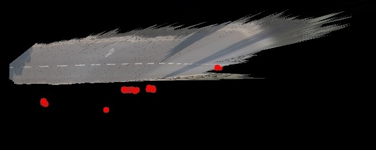
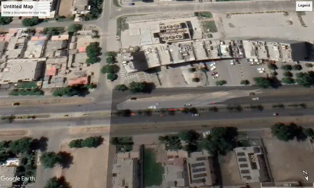
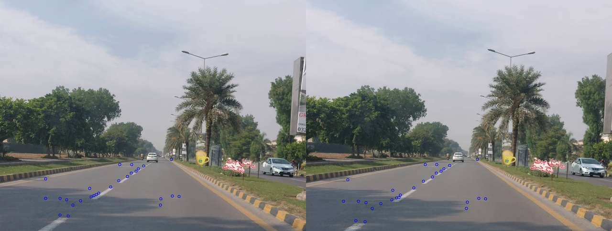
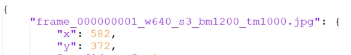
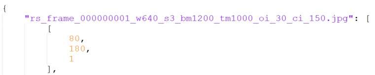
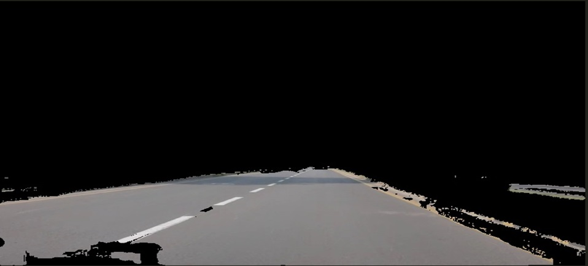
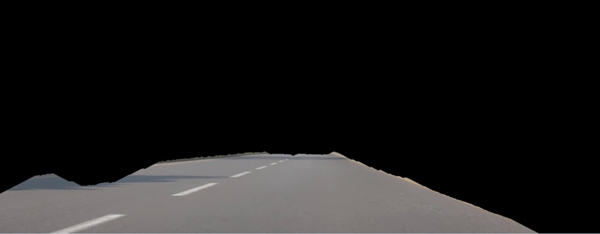

# Road2Sat: CV-2023 Project
## Introduction
In this project we use a dash-cam video which we recorded in DHA phase 5, Lahore and try to project it on satellite view.

### Project members
|Name | Contact |
|---|---|
|Rizwan Ahmad Bhatti | 21030005@lums.edu.pk |
|Faizan Owais | 24100119@lums.edu.pk |

## Repository
```
git clone git@github.com:rizahmad/Road2Sat.git
```

## Implementation
```
Road2Sat/
├─ dataset/
    ├─ frames/
    ├─ roadref/
    ├─ rs_frames/
    ├─ satref/
    ├─ video/
├─ /doc
    *.jpg
├─ gen/
    ├─ cpoint_frames/
    ├─ p_frames/
    interframes_homography.json
    mosaic.jpg
    projectedObjects.json
    road2sat_homography.json
    road_overlay_far.jpg
    road_overlay_near.jpg
├─ resources/
    ├─ models/
        ├─ Stitch-images-using-SuperGlue-GNN/
        ├─ YOLOP/
    ├─ scripts/
        NumpyArrayEncoder.py
        roadSegmentation.py
        selectedPointsHomography.py
        video2frames.py

ProjectReport.pdf
README.md
requirements.txt
Road2Sat.py
```
### ```/dataset/frames```
Frames extracted from the video file must be stored here. See the [video2frames.py section](./README.md#resourcesscriptsvideo2framespy) for details on how to generate images here.

### ```/dataset/roadref```
This directory shall contain the reference image for road dashcam view. Road reference can be the first image from the frames in ```/dataset/frames```.

### ```/dataset/rs_frames```
Images in ```/dataset/frames``` shall be processed to extract the drivable area (road segmentation) along with object detection for vehicles on the road. This directory shall contain all the road segmented image frames along with an ```objects.json``` file containing object detection results. See the [roadSegmentation.py section](./README.md#resourcesscriptsroadsegmentationpy) for details on how to generate files here.

### ```/dataset/satref```
This directory shall contain the reference image for satellite view. Road reference and satellite reference images are used to find the dash-cam view to satellite view homography parameters. See the [selectedPointsHomography.py section](./README.md#resourcesscriptsselectedpointshomographypy) for more details.

### ```/dataset/video```
This directory contains the video file used for this project. This the dash-cam video which we recorded ourselves in DHA phase 5, lahore.

### ```/doc```
Contains visualizations for this document.

### ```/gen```
All files in the gen directory are generated:
- ```/cpoint_frames``` contains corresponding point markings between two consecutive frames. This provides insigts on how good the corresponding point calculation is going. Corresponding points should be larger in number and more accurate to have good warping results. Superglue works better than SIFT.
- ```/p_frames``` contains the projection for each frame present in the ```/dataset/frames``` directory. This allows to check project results for each frame to identify which frame is causing issues.
- ```mosaic.jpg``` is the final mosaic image generated.
- ```projectedObjects.json``` is generated during the generation of project frames. ```objects.json``` file is parsed and transformation is also applied to the location of the objects detected so that they can also be shown when generating the mosaic.
- ```road_overlay_far.jpg``` is the overlay image manually created on Google Earth.
- ```road_overlay_near.jpg``` is the zoomed-in version of ```road_overlay_far.jpg```.
- ```road2sat_homography.json``` contains the dash-cam view to satellite view homography parameters based on the road reference and the satellite reference images.

### ```/resources/models```
This directory contains the third-party modules that we have used.
- ```Stitch-images-using-SuperGlue-GNN``` is used for calculated the corresponding points. Based on our experiments, its performance is much better than SIFT.
- ```YOLOP``` module provides good drivable area segmentation mask and vehicle detection points in the images.

### ```/resources/scripts/NumpyArrayEncoder.py```
This is a utility script which we have developed to serialize the numpy objects so that they can be stored and read from a text file.

### ```/resources/scripts/roadSegmentation.py```
Usage:
```
python ./resources/scripts/roadSegmentation.py -oi OPENING_ITERATIONS -ci CLOSING_ITERATIONS [-n NFRAMES]
```
By using this script we can generate frames based on the dash-cam view frames in ```./dataset/frames```. Script uses the SuperGlue model and generates images and ```objects.json``` file in ```/dataset/rs_frames```. To improve the road segmentation masks we apply morphological operations:
- Opening: This removes extra small noisy pixels in the mask
- Closing: This removes gaps/blank spots in the drivable area.
Script generates the images with parameters used appended in their filenames. Based on experiments, 30 opening iterations and 150 closing iterations gave the best results.

### ```/resources/scripts/selectedPointsHomography.py```
Usage:
```
python .\resources\scripts\selectedPointsHomography.py
```
- The script shall display the road reference image in a new window where user is expected to select four points on the dash-cam view image frame and then press ENTER key.
- Second image shall be displayed in a new window which would be the satellite reference image. User is expected to selected four correspondings here and press ENTER.
Based on the corresponding points selected by the user, homography parameters are calculated and generated in ```./gen/road2sat_homography.json``` file.

### ```/resources/scripts/video2frames.py```
Usage: 
```
python .\resources\scripts\video2frames.py -v VIDEO -w WIDTH -s STRIDE -bm BOTTOM_MARGIN -tm TOP_MARGIN
```
This script is used to extract frames from the dash-cam view video file. It takes path to the video file and is able to extract frames resized to given wideth. For our use-case we wanted to skip some frames so we added the stride parameter and in order to hide unwanted portions of the video, we added bottom margin and top margin. In our experiments we used 640 px width along with bottom margin of 1200 px and top margin of 1000 px. The parameters used to generated the frames are also embedded in the image filenames and stored in the ```./dataset/frames```.

### ```ProjectReport.pdf```
PDF version of this readme.

### ```requirements.txt```
Consists of necessary python libraries and dependencies. We recommend using python virtual environment for the setup.

### ```Road2Sat.py```
Usage:
```
python Road2Sat.py -m MODEL [-rs] [-n NFRAMES] [-c] [-v]
```
For overall algorithm, see [Algorithm section](./README.md#algorithm-for-interframe-homography)
- This script calculates running inter-frame homography parameters for each frame present in the ```/dataset/rs_frames```.
- Dash-cam view to satellite homography parameters are picked from the ```road2sat_homography.json``` file generated earlier using the ```selectedPointshomography.py``` script. We ran this script for 100 frames using the ```-n``` flag to specify the number of frames to be used.
- The script generates warped frames in the ```/gen/p_frames``` directory along with the ```projectedObjects.json``` file which contains transformed object locations.
- ```mosaic.jpg``` is also generated by combining all the projected images.
- Red circles are also drawn on the transformed object locations.

## Results and discussion

### Final Mosaic image
Mosaic has been generated with 100 frames, using every 3rd frames.
- Objects drawn on the other side of road correspond to the traffice present there.
- After about 100 frames, the accumulated error would distort the mosaic result as project frames are of poor quality.



### Satellite overlay


### Corresponding points
Following images shows a sample output from the ```/gen/cpoints_frames``` directory


### Object detection
Detected locations and transformed location comparison can be seen here.
#### dash-cam view

#### Satellite view


### Road segmentation
Following images show the improvement in road segmentation masks with the introduction of opening and closing morphological operations. Notice how unwanted extra pixels are removed and gaps are filled.

#### Without morphological operations

#### With morphological operations


### Algorithm for interframe homography
Highlevel steps are described as below:
1. Get the road to satellite homography parameters.
1. Pick 2 frames from the available images (full images)
2. Calculate corresponding points between both frames.
3. Leave out points which are outside the road segmentation masks. This is important to avoid noise in homography calculation.
4. Calculate homography from the best corresponding points.
5. Multiply road to satellite homography matrix with the current one and create a running-homography matrix.
6. Repeat the above process and use the running-homography matrix for multipling with new homography parameters.

### Conclusion and improvements
Using any dash-cam video we can generate a satellite view using the SuperGlue model for corresponding points and YOLOP model for road segmentation.
- Further improvements are possible by detecting both road edges and filling the area in between instead of detecting all drivable area pixels. 
- IMU correction can be applied on the homography parameters to compensate for the changes in the speed and direction.
